  

  

<h3 align="center">🧑‍💻 About me</h3>

  

<h3 align="center">🛠️ Tools I use</h3>

  

<h3 align="center">🚀 My contribution graph, under attack</h3>

  

<h3 align="center">📈 Contributions</h3>

  

